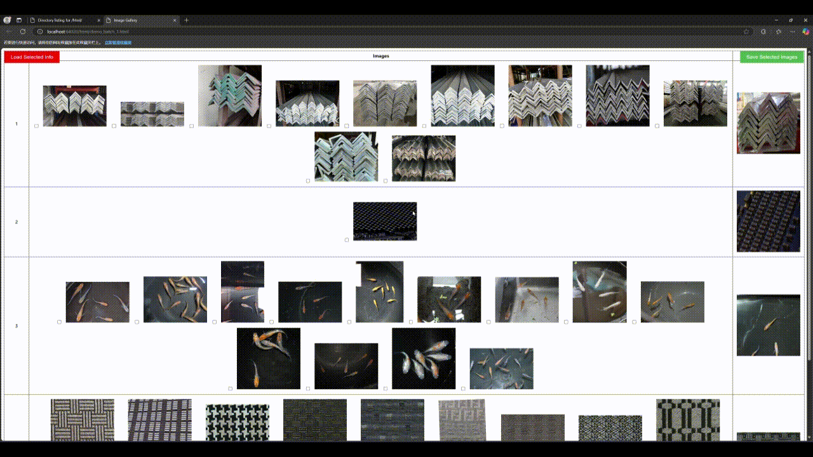

# Demo-Select
Demonstrate pictures and let you select in your browser conveniently

## 中文(ZH-CN)
- [中文文档](README_zh_cn.md)  
  
## Usage
- Delete pictures conveniently
- Mark large amounts of images conveniently
  
## Description
This Python script processes images from a specified directory, groups them by template names, and generates HTML files to visualize the images. Users can select images using checkboxes and save the selected image paths to a text file. The script supports batch processing and creates multiple HTML files if the number of images exceeds a specified threshold.

## Features
- Group images based on their template names or leaf names.
- Resize images for better visualization.
- Generate HTML files displaying images in an organized table.
- Interactive features: select images using checkboxes, save selected images to a text file, and load previously selected images from a text file.

## Demo
A demo of the tool can be viewed in action:

# Saving as txt

# Loading from txt
