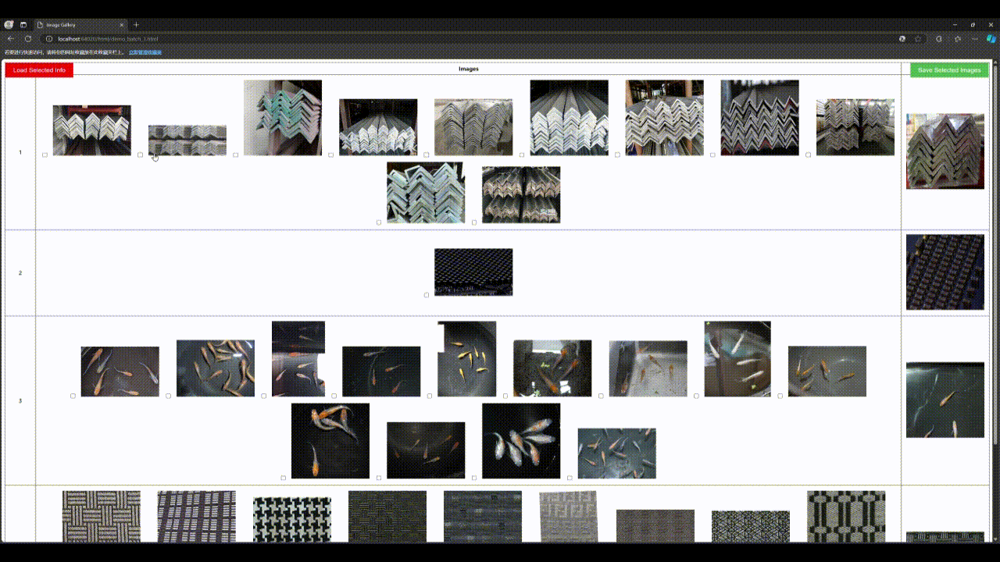

# Demo-Select
展示图片并让你在浏览器中选择图片后导出路径。

## English
- [Documentation](README.md)  

## 描述
这个 Python 脚本处理来自指定目录的图片，将其按模板名称进行分组，并生成 HTML 文件以可视化图片。用户可以通过复选框选择图片，并将选中的图片路径保存到文本文件中。如果图片数量超过指定的阈值，脚本支持批处理，并会生成多个 HTML 文件。

## 功能
- 按模板名称或叶子目录名称对图片进行分组。
- 调整图片大小以便更好的可视化。
- 生成 HTML 文件，以表格形式展示图片。
- 交互功能：通过复选框选择图片，将选中的图片保存到文本文件中，并从文本文件加载之前选择的图片。

## 演示
可以通过以下演示查看工具的实际效果：

